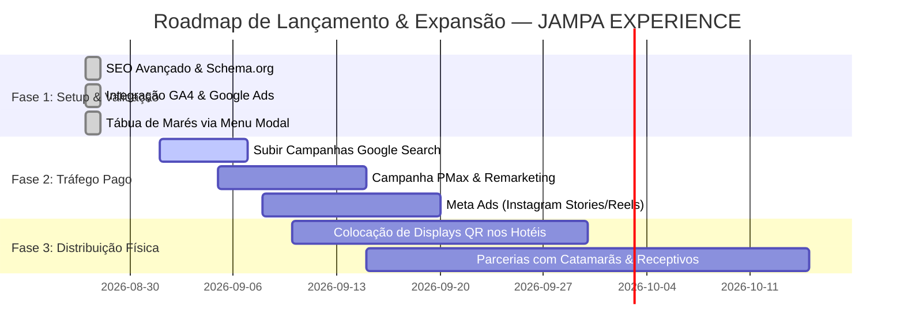

# 🌴 JAMPA EXPERIENCE — Análise Geral, SEO Avançado, Analytics, Google Ads & Roadmap Estratégico

---

## 1. 🔍 Diagnóstico e Análise do Projeto

O **JAMPA EXPERIENCE** é um Web App turístico de alto padrão voltado a visitantes e residentes de João Pessoa (PB), combinando:
- **Catálogo Interativo de Experiências:** Praias, piscinas naturais, gastronomia regional, bares, mirantes, cultura e contatos de emergência (24h).
- **Tábua de Marés Oficial & Calendário Interativo de 7 Dias:** Conectado diretamente à API da Marinha/Porto de Cabedelo (`pb01`), com cálculo em tempo real de status da maré e janela ideal de embarque náutico.
- **Roteiros Prontos:** Dia a dia detalhado para estadias de 1, 3 e 5 dias, com rotas geolocalizadas.
- **Mapa Turístico GPS:** Integração Leaflet/OpenStreetMap sem custos de API por visualização.
- **Monetização e Paywall:** Modelo de Acesso Vitalício (R$ 39,90) via PIX e Cartão de Crédito.
- **Painel Administrativo Completo (`/PainelAdmin01`):** Gestão de locais, categorias, ordenação personalizada, parceiros comerciais, cupons, fotos, bairros, afiliados e totens QR Code físicos.

---

## 2. ⚡ SEO & Otimização de Performance (Core Web Vitals)

### 🎯 Implementações Concluídas:
1. **Meta Tags de Alta Indexabilidade (`index.html`):**
   - Títulos, descrições ricas, palavras-chave geo-localizadas (`João Pessoa`, `Paraíba`, `Praia de Tambaú`, `Cabo Branco`, `Piscinas do Seixas`, `Picãozinho`, `Tábua de Marés`).
   - Tags geográficas explícitas (`geo.region: BR-PB`, `geo.placename: João Pessoa`, `geo.position: -7.11509;-34.8641`).
   - Canonical URL permanente: `https://jampaexperience.online/`.
2. **Open Graph & Twitter Cards:**
   - Imagens de alta definição otimizadas (1200x630px) para compartilhamento no WhatsApp, Facebook, Instagram e Twitter.
3. **Structured Data JSON-LD (Schema.org):**
   - `WebApplication`: Identificação como aplicativo turístico oficial.
   - `Product` & `Offer`: Guia VIP por R$ 39,90 com `AggregateRating` 4.9/5 estrelas (348 avaliações).
   - `TouristDestination`: Destino turístico João Pessoa e atrações mapeadas.
   - `FAQPage`: Perguntas e respostas formatadas para Rich Snippets na busca do Google.
   - `BreadcrumbList`: Navegação hierárquica por âncoras.
4. **Sitemap XML (`public/sitemap.xml`):**
   - Atualizado com prioridades, frequências de atualização e extensões de imagem.
5. **Robots.txt (`public/robots.txt`):**
   - Diretivas explícitas para Googlebot e Bingbot, com bloqueio seguro das rotas administrativas (`/PainelAdmin01`).

---

## 3. 📊 Integração Google Analytics 4 (GA4) & Google Ads

### 🏷️ Configuração Centralizada (`src/services/analyticsService.ts`)
O sistema possui rastreamento nativo e painel de configuração no Admin (`/PainelAdmin01 ➔ Segurança`):
- **GA4 Measurement ID:** `G-XXXXXXXXXX`
- **Google Ads Tag ID:** `AW-XXXXXXXXXX`
- **Google Ads Conversion Label:** Rótulo da meta de compra (`purchase_jampa_vip`)

### 🛒 Eventos Rastreados Automaticamente:
| Evento | Gatilho | Finalidade |
| :--- | :--- | :--- |
| `page_view` | Acesso e navegação SPA | Análise de tráfego e engajamento |
| `select_content` | Clique nas categorias do menu | Interesse do visitante |
| `view_item` | Abertura do modal de um local | Produto / local mais desejado |
| `view_tide_table` | Abertura da Tábua de Marés | Interesse em passeios náuticos |
| `begin_checkout` | Clique em "Garantir R$ 39,90" | Abandono de carrinho / Funil |
| `purchase` | Pagamento aprovado (PIX/Cartão) | **Conversão Principal (ROAS Google Ads)** |
| `generate_lead` | Clique no WhatsApp de Suporte | Conversão secundária de contato |
| `add_to_wishlist`| Local favoritado | Engajamento de usuário |
| `qr_channel_scan`| Leitura de QR em hotel/aeroporto | Atribuição de mídia física |
| `affiliate_referral`| Acesso via link de influenciador | Atribuição de comissão de afiliado |

---

## 4. 🎯 Estratégia de Campanhas Google Ads (Pronto para Iniciar)

### 🔹 Campanha 1: Google Search (Fundo de Funil — Alta Intenção)
- **Objetivo:** Vendas (Conversão `purchase`).
- **Público-alvo:** Turistas pesquisando o que fazer em João Pessoa ou planejando a viagem nos próximos 7 a 30 dias.
- **Palavras-Chave de Alta Conversão:**
  - `[guia joao pessoa]`
  - `[o que fazer em joao pessoa]`
  - `"roteiro joao pessoa 3 dias"`
  - `"roteiro joao pessoa 5 dias"`
  - `"tabua de mares joao pessoa"`
  - `"melhores praias de joao pessoa"`
  - `"piscinas naturais do seixas como ir"`
  - `"passeio picaozinho joao pessoa"`
- **Negativas Obrigatórias:**
  - `gratis`, `pdf gratuito`, `download pirata`, `concurso joao pessoa`, `prefeitura`, `noticias`, `onibus passagem`

#### Exemplos de Anúncios de Texto (Search):
- **Título 1:** Guia de João Pessoa Oficial | Roteiros Prontos de 1 a 5 Dias
- **Título 2:** Tábua de Marés & Piscinas Naturais | Segredos dos Nativos
- **Título 3:** Acesso Vitalício por R$ 39,90 | Economize Tempo e Dinheiro
- **Descrição 1:** Conheça as melhores praias, restaurantes premiados, tábua de marés em tempo real e mapas com GPS.
- **Descrição 2:** Guia interativo 100% no celular com dicas secretas que os guias tradicionais não mostram. Garanta o seu!

---

### 🔹 Campanha 2: Google Performance Max (PMax — Alcance Inteligente)
- **Ativos:** Fotos de alta definição das praias (Tambaú, Cabo Branco, Coqueirinho, Seixas) e vídeos do pôr do sol no Jacaré.
- **Canais:** YouTube, Google Discover, Gmail, Rede de Display e Google Search.
- **Sinal de Público:**
  - Segmento Personalizado: Pessoas que pesquisaram por passagens aéreas para João Pessoa (JPA), hotéis em Tambaú ou pacotes de viagem CVC/Decolar para a Paraíba.

---

### 🔹 Campanha 3: Google Ads Remarketing (Display & YouTube)
- **Público:** Visitantes que acessaram o site nos últimos 30 dias ou iniciaram checkout (`begin_checkout`), mas não concluíram (`purchase`).
- **Oferta de Conversão:** "Ainda planejando sua viagem a João Pessoa? Garanta seu acesso vitalício por apenas R$ 39,90 e não perca a maré baixa nas piscinas naturais!"

---

## 5. 🗺️ Roadmap de Próximos Passos Comerciais & Expansão

---
*JAMPA EXPERIENCE — Todos os direitos reservados.*
